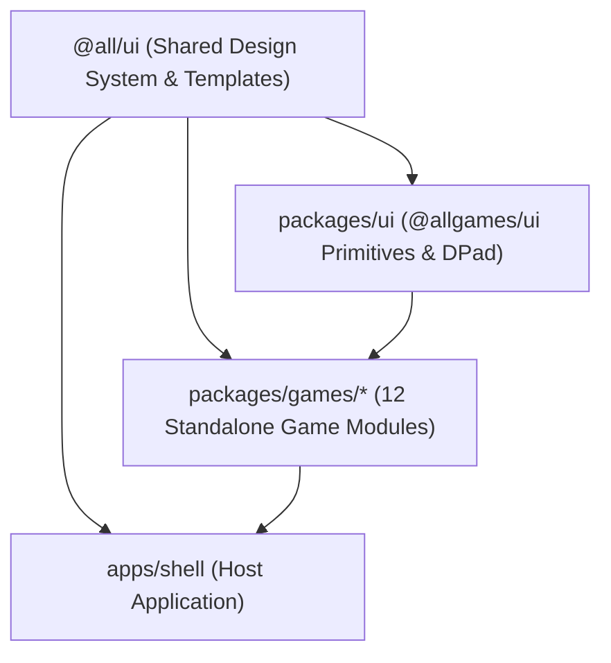

# AllGames

<p align="center">
  <strong>A minimalist sketch-and-ink collection of browser-based mini-games.</strong><br>
  No accounts, no tracking, no ads — 100% client-side, offline-ready Progressive Web App (PWA).<br>
  Available in English and Polish.
</p>

<p align="center">
  <a href="https://github.com/patrasxd/AllGames/blob/main/LICENSE"></a>
  
  
  
  
  
</p>

---

## Table of Contents

- [Overview](#overview)
- [Key Features](#key-features)
- [Games Catalog](#games-catalog)
- [Architecture & Monorepo](#architecture--monorepo)
- [Design System & Themes](#design-system--themes)
- [Game API Contract](#game-api-contract)
- [Getting Started](#getting-started)
- [Adding a New Game](#adding-a-new-game)
- [Storage & Persistence](#storage--persistence)
- [License](#license)

---

## Overview

**AllGames** is an open-source, distraction-free gaming suite built for both desktop and mobile web. Every game is written with modern React, packaged as an independent monorepo workspace module, and styled with a tactile sketchbook ink aesthetic.

The application adheres to strict privacy and usability standards: zero third-party scripts, zero analytics, instant offline caching, and responsive viewports calibrated to fit without page-level scrollbars.

---

## Key Features

- 📴 **Offline-First PWA**: Installable to home screens and desktops via Service Workers and Web App Manifest.
- 🔒 **Zero Telemetry & Ads**: All gameplay, scores, and preferences stay strictly on your local device.
- 📐 **Zero-Scroll Viewports**: Every game interface dynamically scales within a single viewport (`100dvh`), avoiding unwanted page scrollbars.
- 🌓 **4 Visual Themes**: Light, Dark, E-Ink Light (high-contrast monochrome for e-readers), and E-Ink Dark.
- 🎬 **Independent Motion Engine**: Smooth Framer Motion transitions with full `prefers-reduced-motion` compliance and forced zero-motion in E-Ink modes.
- 🌐 **Bilingual (EN / PL)**: Instant runtime localization across all menus, controls, and game instructions.
- 🧱 **Modular Architecture**: Autonomous game packages coordinated by an eager-metadata / lazy-component host shell.

---

## Games Catalog

AllGames features **12 fully playable games**, spanning arcade classics, logic puzzles, and strategic board games:

| Game              | Slug            | Players / AI | Template          | Description                                                                                            |
| :---------------- | :-------------- | :----------- | :---------------- | :----------------------------------------------------------------------------------------------------- |
| **Wing Rush**     | `wing-rush`     | 1P           | `FullBleedLayout` | Minimalist physics arcade. Tap to flap wings, weave through architectural gates, and beat high scores. |
| **Crystal Match** | `crystal-match` | 1P           | `BoardLayout`     | Cascading match-3 puzzle saga. Swap crystals, trigger explosive combos, and beat tiered level targets. |
| **Tic-Tac-Toe**   | `tic-tac-toe`   | 1P / 2P      | `BoardLayout`     | Classic 3x3 grid with local 2-player mode and 3-difficulty Minimax AI.                                 |
| **Snake**         | `snake`         | 1P           | `BoardLayout`     | Retro snake with 3 map layouts (Border, Open, Obstacles), speed presets, and high score tracking.      |
| **Checkers**      | `checkers`      | 1P / 2P      | `BoardLayout`     | Traditional 8x8 checkers supporting local pass-and-play or Minimax computer opponent.                  |
| **Chess**         | `chess`         | 1P / 2P      | `BoardLayout`     | Full FIDE rules (castling, en passant, pawn promotion) with local 2P or Minimax AI.                    |
| **Minesweeper**   | `minesweeper`   | 1P           | `BoardLayout`     | Safe first click guarantee, quick-flagging, 3 board dimensions, and timer records.                     |
| **2048**          | `2048`          | 1P           | `BoardLayout`     | Number sliding puzzle supporting 3x3, 4x4, and 5x5 grids, swipe gestures, move undo, and best scores.  |
| **Memory**        | `memory`        | 1P / 2P      | `BoardLayout`     | Hand-drawn vector sketch icon matching with 3 board densities and turn-based 2-player mode.            |
| **Sudoku**        | `sudoku`        | 1P           | `BoardLayout`     | Procedurally generated puzzles across 3 difficulties with pencil notes, mistake counter, and timer.    |
| **Sea Battle**    | `sea-battle`    | 1P / 2P      | `BoardLayout`     | Tactical radar grid battleship with fleet auto-deployment and 3-tier computer AI.                      |
| **Solitaire**     | `solitaire`     | 1P           | `BoardLayout`     | Classic Klondike (Draw 1 / Draw 3), smart move hints, undo stack, auto-finish, and Vegas scoring.      |

---

## Architecture & Monorepo

AllGames is organized as an **npm workspaces monorepo** powered by Vite, consuming the shared neutral UI library (`@all/ui`):



### Directory Tree

```
AllGames/
├── package.json                   # Root monorepo configuration & scripts
├── README.md                      # Project documentation
│
├── apps/
│   └── shell/                     # Host application (Vite + React + TS)
│       ├── src/
│       │   ├── games/             # Eager metadata registry & lazy component loaders
│       │   ├── i18n/              # Shell translations & context (EN / PL)
│       │   ├── components/        # AppHeader, GameCard, Navigation
│       │   ├── pages/             # HomePage, GamePage (zero-scroll container)
│       │   ├── styles/            # Global token imports & resets
│       │   ├── types/             # GameMetadata & GameComponentProps contracts
│       │   ├── App.tsx            # Route handling & transitions
│       │   └── main.tsx           # ThemeProvider, MotionProvider, React root
│       ├── public/
│       │   ├── manifest.json      # PWA manifest
│       │   └── icons/             # App icons & favicon
│       └── vite.config.ts         # Vite configuration with PWA plugin
│
├── packages/
│   ├── ui/                        # Game-specific UI primitives (@allgames/ui)
│   │   └── src/                   # DPad, GameModal, GameResultOverlay, useGameTimer
│   └── games/                     # 12 Standalone Game Packages
│       ├── 2048/
│       ├── checkers/
│       ├── chess/
│       ├── crystal-match/
│       ├── memory/
│       ├── minesweeper/
│       ├── sea-battle/
│       ├── snake/
│       ├── solitaire/
│       ├── sudoku/
│       ├── tic-tac-toe/
│       └── wing-rush/
│
└── AllUI/                         # Git Submodule referencing @all/ui design system
```

---

## Design System & Themes

All visual tokens and layout primitives are provided by `@all/ui`:

- **Semantic Tokens**: Components strictly consume semantic CSS variables (`--all-bg`, `--all-surface`, `--all-border`, `--all-text`, `--all-accent`, `--all-space-*`).
- **Typography Stack**:
  - Headings & Titles: Serif accent (`Instrument Serif` italic)
  - UI & Controls: Sans-serif system stack (`system-ui, -apple-system, BlinkMacSystemFont, Segoe UI, Roboto`)
  - Numbers & Stats: Monospace (`ui-monospace, JetBrains Mono, monospace`)
- **Theme Matrix**:
  - `dark` (default): Sleek low-light contrast.
  - `light`: Crisp ink-on-paper sketchbook appearance.
  - `e-ink-light`: Pure monochrome black-and-white (`#000` / `#fff`), zero shadows, high-contrast borders for electronic paper screens.
  - `e-ink-dark`: Inverted monochrome E-Ink palette.
- **Motion Isolation**: Motion profile (`none`, `normal`, `expressive`) automatically forces `none` under E-Ink themes or when `prefers-reduced-motion` is active.

---

## Game API Contract

Every game module in `packages/games/<slug>` is an autonomous package exporting lightweight metadata and a lazy-loadable component.

### 1. Metadata Export (`src/metadata.tsx`)

```tsx
import type { GameMetadata } from './types'

export const metadata: GameMetadata = {
  slug: 'tic-tac-toe',
  name: {
    en: 'Tic-Tac-Toe',
    pl: 'Kółko i krzyżyk',
  },
  description: {
    en: 'Classic 3x3 game. Play against a friend or challenge the computer.',
    pl: 'Klasyczne kółko i krzyżyk. Graj z przyjacielem lub zmierz się z komputerem.',
  },
  icon: <TicTacToeIcon />,
  tags: {
    en: ['classic', '2 players', 'vs computer'],
    pl: ['klasyczna', '2 graczy', 'vs komputer'],
  },
  minPlayers: 1,
  maxPlayers: 2,
}
```

### 2. Component Export (`src/index.tsx`)

```tsx
import type { GameComponentProps } from './types'

export { TicTacToe as GameComponent } from './TicTacToe'
export { metadata } from './metadata'
```

### 3. Component Props (`GameComponentProps`)

```ts
export interface GameComponentProps {
  /** Current language code ('en' | 'pl') */
  locale: 'en' | 'pl'
  /** Optional callback to render custom status/widgets into the top shell header */
  setHeader?: (content: React.ReactNode) => void
  /** Optional callback to notify the shell whether a game session is active */
  setIsActive?: (active: boolean) => void
}
```

---

## Getting Started

### Prerequisites

- **Node.js**: `18.0.0` or higher
- **npm**: `9.0.0` or higher (supporting npm workspaces)

### Installation & Run

```bash
# Clone repository with submodules
git clone --recurse-submodules https://github.com/patrasxd/AllGames.git
cd AllGames

# Install all monorepo dependencies
npm install

# Start local development server
npm run dev

# Run ESLint linter
npm run lint

# Check code formatting with Prettier
npm run format:check

# Run static TypeScript checks
npm run typecheck

# Run full Vitest test suite across all games
npm test

# Build production bundle
npm run build

# Preview production build locally
npm run preview
```

### Deployment

Deployment is fully automated via GitHub Actions ([`.github/workflows/deploy.yml`](.github/workflows/deploy.yml)) on push to the `main` branch:

1. **Verification**: Checks out the repository with recursive submodules (`AllUI`), performs a clean install (`npm ci`), runs ESLint linter (`npm run lint`), runs TypeScript checks (`npm run typecheck`), and executes the Vitest test suite (`npm test`). Deployment is blocked if any check fails.
2. **Build & SPA Routing**: Builds the production bundle (`npm run build`) and copies `apps/shell/dist/index.html` to `apps/shell/dist/404.html`, ensuring deep links and page refreshes work properly under GitHub Pages without `HashRouter`.
3. **Publishing**: Publishes the build output (`apps/shell/dist`) directly to GitHub Pages via `peaceiris/actions-gh-pages`.

---

## Adding a New Game

1. **Scaffold Package**:
   Create a new folder under `packages/games/<new-game>` with its own `package.json` named `@allgames/<new-game>`.
2. **Implement Logic & UI**:
   Build the game using layout templates from `@all/ui` (such as `BoardLayout` or `FullBleedLayout`) and controls from `@all/ui` or `@allgames/ui`.
3. **Export Metadata & Component**:
   Implement `src/metadata.tsx` and export `{ metadata, GameComponent }` from `src/index.tsx`.
4. **Register in Shell**:
   Add eager metadata and lazy component loader to `apps/shell/src/games/registry.ts`.
5. **Add Tests**:
   Write unit/integration tests in `src/__tests__/` and verify with `npm test`.

---

## Storage & Persistence

All client-side state is stored strictly in browser `localStorage` using standardized prefixes:

| Key Format                 | Type                                                 | Description                                   |
| :------------------------- | :--------------------------------------------------- | :-------------------------------------------- |
| `allgames:theme`           | `'dark' \| 'light' \| 'e-ink-light' \| 'e-ink-dark'` | Active theme preference                       |
| `allgames:language`        | `'en' \| 'pl'`                                       | User language preference                      |
| `allgames:<slug>:settings` | `JSON Object`                                        | Game settings (difficulty, board size, sound) |
| `allgames:<slug>:stats`    | `JSON Object`                                        | High scores, win/loss records, best times     |

---

## License

This project is licensed under the [MIT License](LICENSE).
