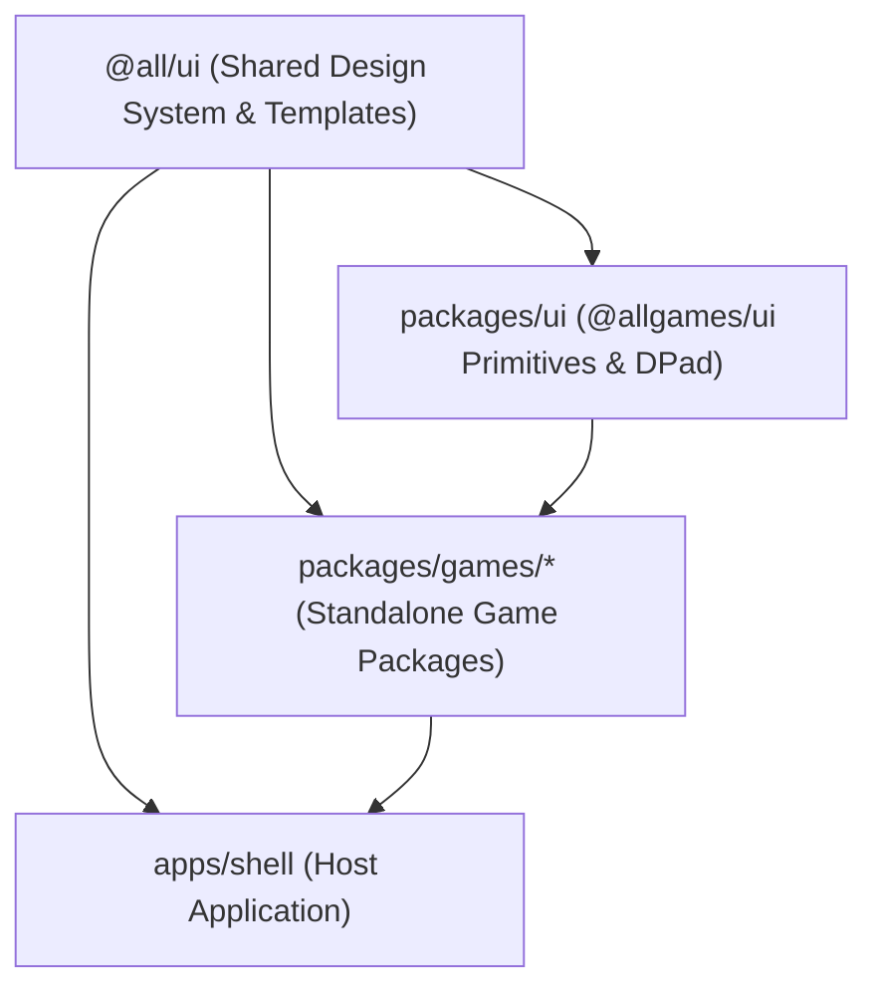

# AllGames

<p align="center">
  <strong>A minimalist sketch-and-ink collection of browser-based mini-games.</strong><br>
  No accounts, no tracking, no ads — 100% client-side, offline-ready Progressive Web App (PWA).<br>
  Available in English and Polish.
</p>

<p align="center">
  <a href="https://github.com/patrasxd/AllGames/blob/main/LICENSE"></a>
  
  
  
  
  
</p>

---

## Table of Contents

- [Overview](#overview)
- [Key Features](#key-features)
- [Quick Start](#quick-start)
- [Games Catalog](#games-catalog)
- [Architecture & Monorepo](#architecture--monorepo)
- [Design System & Themes](#design-system--themes)
- [Adding a New Game & API Contract](#adding-a-new-game--api-contract)
- [Storage & Persistence](#storage--persistence)
- [Deployment](#deployment)
- [License](#license)

---

## Overview

**AllGames** is an open-source, distraction-free gaming suite built for desktop and mobile web. Every game is written with modern React, packaged as an independent monorepo workspace module, and styled with a tactile sketchbook ink aesthetic.

The application adheres to strict privacy and usability standards: zero third-party scripts, zero analytics, instant offline caching, and responsive viewports calibrated to fit without page-level scrollbars.

---

## Key Features

- 📴 **Offline-First PWA**: Installable to home screens and desktops via Service Workers and Web App Manifest.
- 🔒 **Zero Telemetry & Ads**: All gameplay, scores, and preferences stay strictly on your local device.
- 📐 **Zero-Scroll Viewports**: Every game interface dynamically scales within a single viewport (`100dvh`), avoiding unwanted page scrollbars.
- 🌓 **4 Visual Themes**: Light, Dark, E-Ink Light (high-contrast monochrome for e-readers), and E-Ink Dark.
- 🎬 **Independent Motion Engine**: Smooth Framer Motion transitions with full `prefers-reduced-motion` compliance and forced zero-motion in E-Ink modes.
- 🌐 **Bilingual (EN / PL)**: Instant runtime localization across all menus, controls, and game instructions.
- 🧱 **Modular Architecture**: Autonomous game packages coordinated by an eager-metadata / lazy-component host shell.

---

## Quick Start

### Prerequisites

- **Node.js**: `18.0.0` or higher
- **npm**: `9.0.0` or higher (supporting npm workspaces)

### Installation & Development

```bash
# 1. Clone repository with submodules (@all/ui)
git clone --recurse-submodules https://github.com/patrasxd/AllGames.git
cd AllGames

# 2. Install all monorepo dependencies
npm install

# 3. Start local development server
npm run dev
```

### Scripts Reference

| Command                | Description                                     |
| :--------------------- | :---------------------------------------------- |
| `npm run dev`          | Starts the Vite development server              |
| `npm test`             | Runs the full Vitest suite across all packages  |
| `npm run typecheck`    | Runs TypeScript type-checking across workspaces |
| `npm run lint`         | Checks code quality with ESLint                 |
| `npm run format:check` | Verifies formatting with Prettier               |
| `npm run build`        | Builds production bundles for deployment        |
| `npm run preview`      | Previews the production build locally           |

---

## Games Catalog

AllGames features a growing collection of browser-based mini-games, spanning arcade classics, logic puzzles, and strategic board games:

| Game               | Slug             | Players / AI | Template               | Description                                                                                                        |
| :----------------- | :--------------- | :----------- | :--------------------- | :----------------------------------------------------------------------------------------------------------------- |
| **Wing Rush**      | `wing-rush`      | 1P           | `FullBleedLayout`      | Minimalist physics arcade. Tap to flap wings, weave through architectural gates, and beat high scores.             |
| **Artillery Duel** | `artillery`      | 1P / 2P      | `FullBleedLayout`      | Tactical ballistic tank duel with procedural destructible clay terrain, wind physics, and computer AI.             |
| **Bubble Shooter** | `bubble-shooter` | 1P           | `FullBleedLayout`      | Aim, bounce off the walls, and match 3+ colored bubbles before the hex grid reaches the bottom.                    |
| **Ball Sort**      | `ball-sort`      | 1P           | `BoardLayout` (fluid)  | Pour colors between tubes until every one holds a single color. 200+ seeded levels, stars, undo.                   |
| **Alchemy**        | `alchemy`        | 1P           | `BoardLayout` (wide)   | Combine four basic elements into 300+ others. Drag or tap to mix, hints, searchable collection.                    |
| **Block Out**      | `block-out`      | 1P           | `BoardLayout` (square) | Slide blocks along their axes to clear a path and guide the red block to freedom. 200+ levels, star ratings, undo. |
| **Crystal Match**  | `crystal-match`  | 1P           | `BoardLayout`          | Cascading match-3 puzzle saga. Swap crystals, trigger explosive combos, and beat tiered level targets.             |
| **Tic-Tac-Toe**    | `tic-tac-toe`    | 1P / 2P      | `BoardLayout`          | Classic 3x3 grid with local 2-player mode and 3-difficulty Minimax AI.                                             |
| **Snake**          | `snake`          | 1P           | `BoardLayout`          | Retro snake with 3 map layouts (Border, Open, Obstacles), speed presets, and high score tracking.                  |
| **Checkers**       | `checkers`       | 1P / 2P      | `BoardLayout`          | Traditional 8x8 checkers supporting local pass-and-play or Minimax computer opponent.                              |
| **Chess**          | `chess`          | 1P / 2P      | `BoardLayout`          | Full FIDE rules (castling, en passant, pawn promotion) with local 2P or Minimax AI.                                |
| **Minesweeper**    | `minesweeper`    | 1P           | `BoardLayout`          | Safe first click guarantee, quick-flagging, 3 board dimensions, and timer records.                                 |
| **2048**           | `2048`           | 1P           | `BoardLayout`          | Number sliding puzzle supporting 3x3, 4x4, and 5x5 grids, swipe gestures, move undo, and best scores.              |
| **Memory**         | `memory`         | 1P / 2P      | `BoardLayout`          | Hand-drawn vector sketch icon matching with 3 board densities and turn-based 2-player mode.                        |
| **Sudoku**         | `sudoku`         | 1P           | `BoardLayout`          | Procedurally generated puzzles across 3 difficulties with pencil notes, mistake counter, and timer.                |
| **Sea Battle**     | `sea-battle`     | 1P / 2P      | `BoardLayout`          | Tactical radar grid battleship with fleet auto-deployment and 3-tier computer AI.                                  |
| **Solitaire**      | `solitaire`      | 1P           | `BoardLayout`          | Classic Klondike (Draw 1 / Draw 3), smart move hints, undo stack, auto-finish, and Vegas scoring.                  |

---

## Architecture & Monorepo

AllGames is organized as an **npm workspaces monorepo** powered by Vite, consuming the shared neutral UI library (`@all/ui`):


```mermaid
graph TD
    SharedUI["@all/ui (Shared Design System & Templates)"]
    Shell["apps/shell (Host Application)"]
    GamesUI["packages/ui (@allgames/ui Primitives & DPad)"]
    Games["packages/games/* (Standalone Game Packages)"]

    SharedUI --> Shell
    SharedUI --> GamesUI
    SharedUI --> Games
    GamesUI --> Games
    Games --> Shell
```

### Directory Structure

```text
AllGames/
├── package.json                   # Root monorepo configuration & workspaces
├── README.md                      # Project documentation
│
├── apps/
│   └── shell/                     # Host application (Vite + React + TS)
│       ├── src/
│       │   ├── games/             # Eager metadata registry & lazy component loaders
│       │   ├── i18n/              # Shell translations & context (EN / PL)
│       │   ├── components/        # AppHeader, GameCard, Navigation
│       │   ├── pages/             # HomePage, GamePage (zero-scroll container)
│       │   ├── styles/            # Global token imports & resets
│       │   ├── types/             # Shell contracts & GameComponentProps
│       │   ├── App.tsx            # Route handling & transitions
│       │   └── main.tsx           # Providers (Theme, Motion) & React root
│       ├── public/
│       │   ├── manifest.json      # PWA manifest
│       │   └── icons/             # App icons & favicon
│       └── vite.config.ts         # Vite configuration with PWA plugin
│
├── packages/
│   ├── ui/                        # Game-specific UI primitives (@allgames/ui)
│   │   └── src/                   # DPad, GameModal, GameResultOverlay, useGameTimer
│   └── games/                     # Standalone game packages
│       └── <game-slug>/           # Isolated game module (e.g. chess, solitaire, ...)
│           ├── package.json       # @allgames/<game-slug>
│           └── src/               # Game logic, UI components, metadata.tsx & tests
│
└── AllUI/                         # Git Submodule referencing @all/ui design system
```

---

## Design System & Themes

All visual tokens and layout primitives are provided by `@all/ui`:

- **Semantic Tokens**: Components strictly consume semantic CSS variables (`--all-bg`, `--all-surface`, `--all-border`, `--all-text`, `--all-accent`, `--all-space-*`).
- **Typography Stack**:
  - Headings & Titles: Serif accent (`Instrument Serif` italic)
  - UI & Controls: Sans-serif system stack (`system-ui, -apple-system, BlinkMacSystemFont, Segoe UI, Roboto`)
  - Numbers & Stats: Monospace (`ui-monospace, JetBrains Mono, monospace`)
- **Theme Matrix**:
  - `dark` (default): Sleek low-light contrast.
  - `light`: Crisp ink-on-paper sketchbook appearance.
  - `e-ink-light`: Pure monochrome black-and-white (`#000` / `#fff`), zero shadows, high-contrast borders for electronic paper screens.
  - `e-ink-dark`: Inverted monochrome E-Ink palette.
- **Motion Isolation**: Motion profile (`none`, `normal`, `expressive`) automatically forces `none` under E-Ink themes or when `prefers-reduced-motion` is active.

---

## Adding a New Game & API Contract

Every game module in `packages/games/<slug>` is an autonomous workspace package exporting lightweight metadata and a lazy-loadable component.

### 1. Game Package Structure

Create `packages/games/<new-game>` with its own `package.json` (`@allgames/<new-game>`):

```
packages/games/<new-game>/
├── package.json
└── src/
    ├── <GameName>.tsx             # Core game component
    ├── metadata.tsx               # Eager metadata export
    ├── index.tsx                  # Public package entry
    ├── types.ts                   # Game-specific types
    └── __tests__/                 # Vitest test suite
```

### 2. Export Metadata (`src/metadata.tsx`)

```tsx
import type { GameMetadata } from './types'

export const metadata: GameMetadata = {
  slug: 'new-game',
  name: { en: 'New Game', pl: 'Nowa Gra' },
  description: { en: 'Game description', pl: 'Opis gry' },
  icon: <GameIcon />,
  tags: { en: ['tag1'], pl: ['tag1'] },
  minPlayers: 1,
  maxPlayers: 2,
}
```

### 3. Component Contract (`src/index.tsx`)

Every game component receives `GameComponentProps`:

```ts
export interface GameComponentProps {
  locale: 'en' | 'pl'
  theme?: string
  isEink?: boolean
  setHeader?: (content: React.ReactNode) => void
  setIsActive?: (active: boolean) => void
}
```

Export both from `src/index.tsx`:

```tsx
export { NewGame as GameComponent } from './NewGame'
export { metadata } from './metadata'
```

### 4. Register in Shell

Add the new game to `apps/shell/src/games/registry.ts`:

```ts
import { metadata as newGameMetadata } from '@allgames/new-game/metadata'

// In GAMES array:
{
  metadata: newGameMetadata,
  load: lazyGame(() => import('@allgames/new-game')),
}
```

---

## Storage & Persistence

All client-side state is stored strictly in browser `localStorage` using standardized prefixes:

| Key Format                 | Type                                                 | Description                                   |
| :------------------------- | :--------------------------------------------------- | :-------------------------------------------- |
| `allgames:theme`           | `'dark' \| 'light' \| 'e-ink-light' \| 'e-ink-dark'` | Active theme preference                       |
| `allgames:language`        | `'en' \| 'pl'`                                       | User language preference                      |
| `allgames:<slug>:settings` | `JSON Object`                                        | Game settings (difficulty, board size, sound) |
| `allgames:<slug>:stats`    | `JSON Object`                                        | High scores, win/loss records, best times     |

Production builds enforce a strict Content Security Policy (`connect-src 'self'`), providing a technical guarantee that the application cannot send data or telemetry to external servers. All game logic, state, and statistics remain strictly local to your device.

---

## Deployment

Continuous deployment is automated via GitHub Actions on push to `main`:

1. **Verification**: Checks out submodules (`AllUI`), runs `npm ci`, linter (`npm run lint`), TypeScript checks (`npm run typecheck`), and Vitest test suite (`npm test`).
2. **Build**: Generates production SPA bundles (`npm run build`) and creates a `404.html` copy for direct client-side routing on GitHub Pages.
3. **Publish**: Deploys `apps/shell/dist` to GitHub Pages via `peaceiris/actions-gh-pages`.

---

## License

This project is licensed under the [MIT License](LICENSE).
